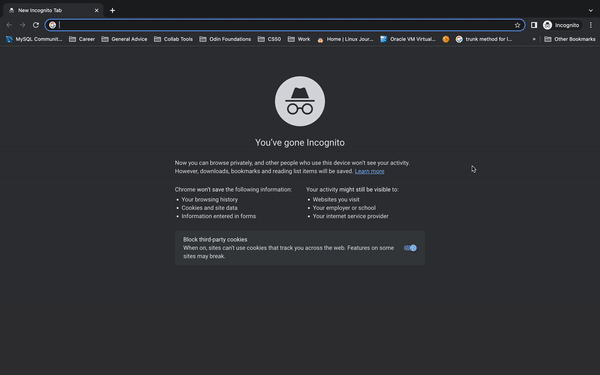

# Kanazawa

Sign-up is a project from the [Javascript](https://www.theodinproject.com/paths/full-stack-javascript/courses/javascript) section of [The Odin Project](https://www.theodinproject.com). It is intended to give students an introduction to ES6 modules, SPAs, and working with module bundlers such as webpack. Working demo [here](https://implexrr.github.io/kanazawa-sushi/).



## Installation

To create a copy of the project, type the following command into your terminal:

```bash
git clone git@github.com:implexrr/kanazawa-sushi.git
```

## Usage/Features
[Take a look here!](https://implexrr.github.io/kanazawa-sushi/). The website is a single-page application where most of the html was rendered via vanilla JS components and bundled together using webpack, allowing the content to be served dynamically.


## Things I learnt creating the project
This project was written almost entirely in CSS/JS.
- Component-based JS architecture
- Working with npm
- ES6 modules
- Module bundlers
- Webpack
  - Source maps
  - Asset management
  - Output management
  - Code splitting
- Sass

## Contributing

Pull requests are welcome. For major changes, please open an issue first
to discuss what you would like to change.

Please make sure to update tests as appropriate.

## License

[MIT](https://choosealicense.com/licenses/mit/)